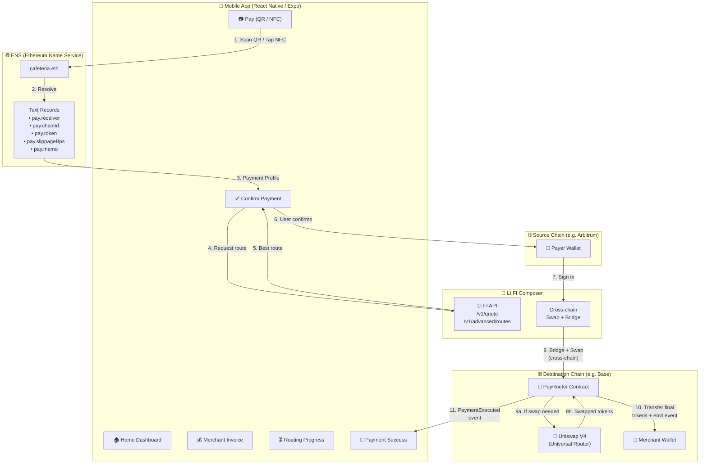
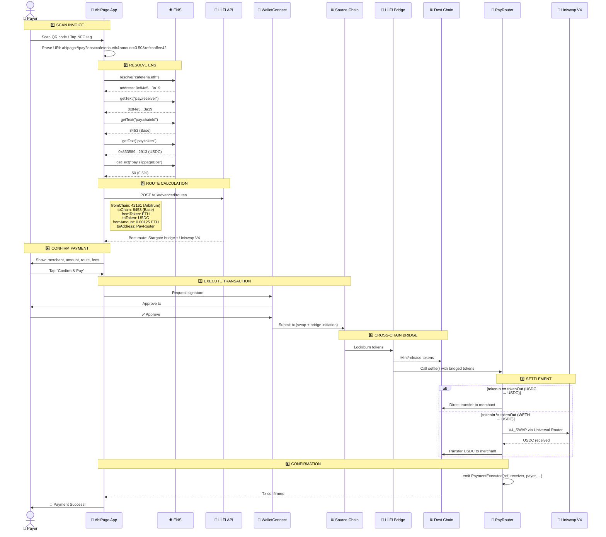
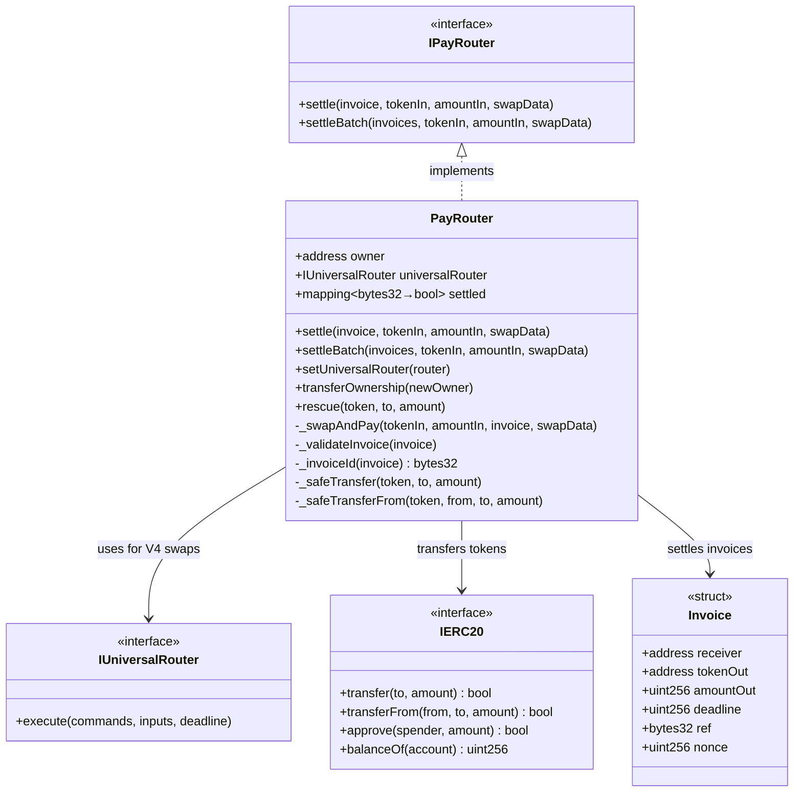
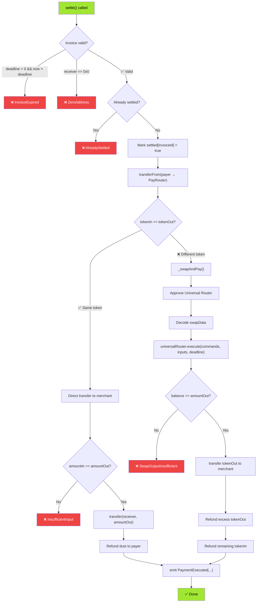
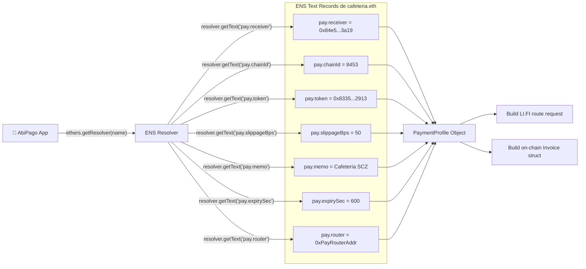
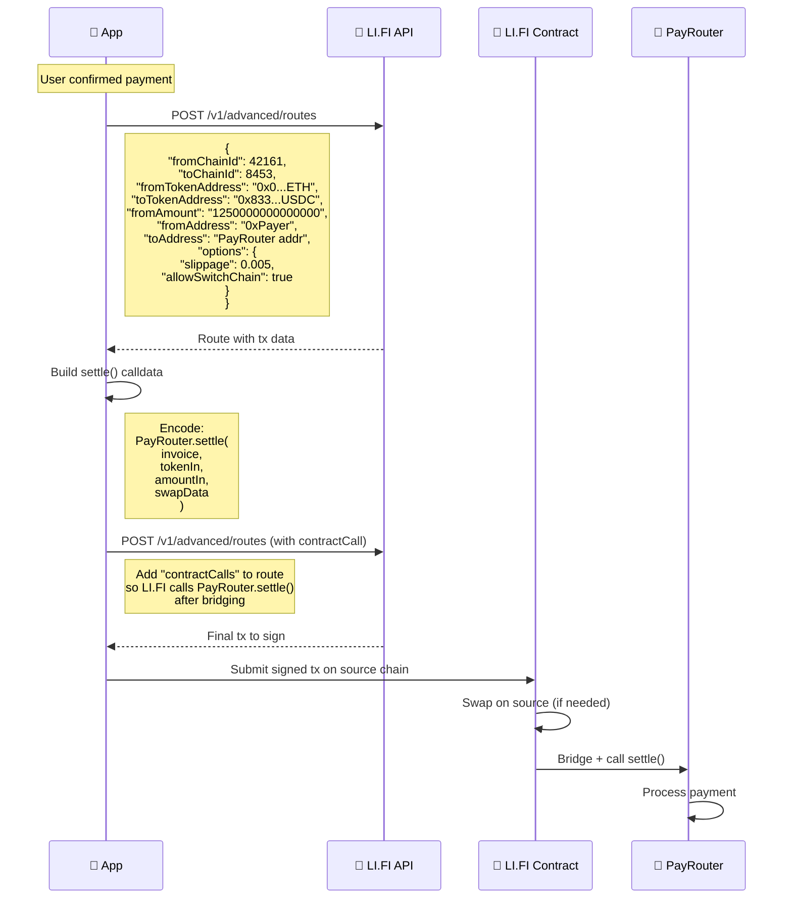
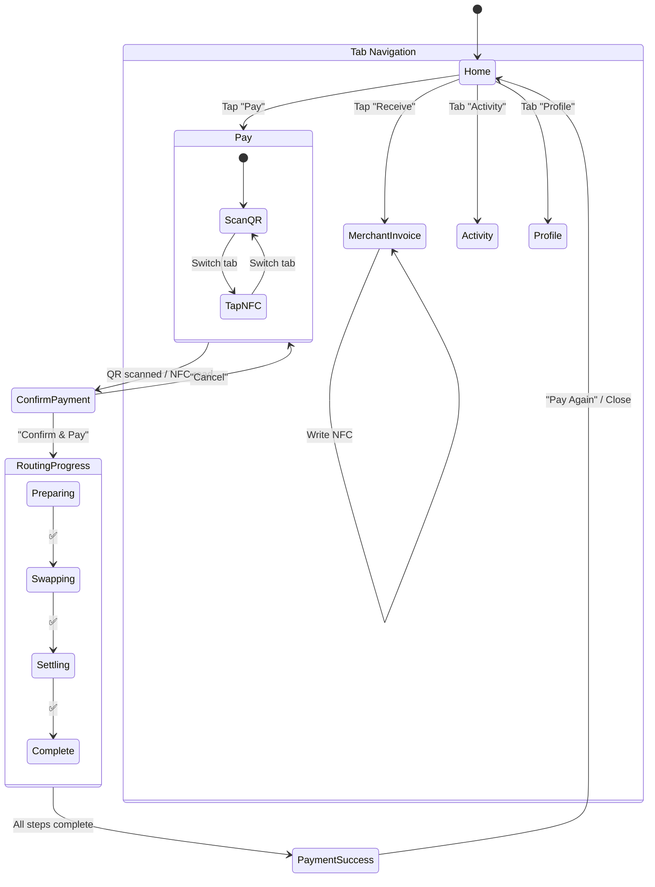
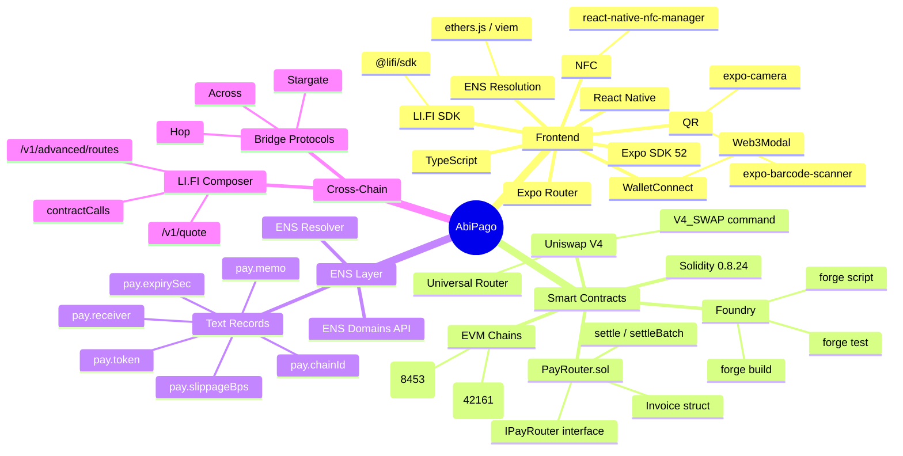
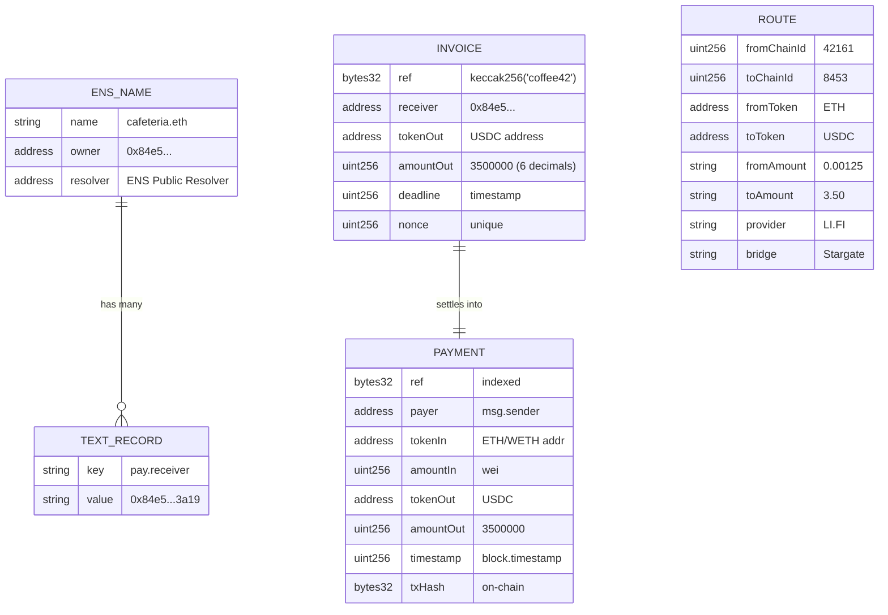

# AbiPago — Arquitectura del Sistema

> Documentación técnica con diagramas de arquitectura para entender cómo funcionan todos los componentes de AbiPago.

---

## 1. Vista General del Sistema

---

## 2. Flujo Completo de Pago (Secuencia)

---

## 3. Arquitectura del Smart Contract: PayRouter

---

## 4. Lógica Interna de `settle()` (Flowchart)

---

## 5. ENS como "Payment Profile" (Capa de Configuración)

---

## 6. Integración LI.FI Composer

---

## 7. Flujo de Pantallas de la App

---

## 8. Stack Tecnológico

---

## 9. Modelo de Datos

