# AbiPago — Arquitectura del Sistema (Final)

> Documentación técnica con diagramas de arquitectura. Refleja el estado **final** del smart contract  
> **PayRouter v2** desplegado y verificado en **Unichain mainnet** (chain 130).
>
> Contrato: [`0x91Bf4c06D2A588980450Bb6AEDc43f1923f149c2`](https://unichain.blockscout.com/address/0x91Bf4c06D2A588980450Bb6AEDc43f1923f149c2)

---

## 1. Vista General del Sistema

```mermaid
graph TB
    subgraph "📱 Mobile App · React Native / Expo"
        HOME["🏠 Home Dashboard"]
        PAY["📷 Pay · QR / NFC"]
        RECEIVE["💰 Merchant Invoice"]
        CONFIRM["✅ Confirm Payment"]
        PROGRESS["⏳ Routing Progress"]
        SUCCESS["🎉 Payment Success"]
    end

    subgraph "🌐 ENS · Ethereum Name Service"
        ENS_NAME["cafeteria.eth"]
        ENS_RECORDS["Text Records<br/>• pay.receiver<br/>• pay.chainId<br/>• pay.token<br/>• pay.slippageBps<br/>• pay.memo<br/>• pay.router"]
    end

    subgraph "🔗 LI.FI Composer"
        LIFI_API["LI.FI API<br/>/v1/quote<br/>/v1/advanced/routes"]
        LIFI_EXEC["Cross-chain<br/>Swap + Bridge"]
    end

    subgraph "⛓️ Unichain Mainnet · Chain 130"
        PAYROUTER["📄 PayRouter v2<br/>0x91Bf…9c2"]
        UNISWAP["🦄 Uniswap V4<br/>Universal Router<br/>0xEf74…af3"]
        PERMIT2["🔐 Permit2<br/>0x0000…BA3"]
        WETH["💎 WETH<br/>0x4200…0006"]
        MERCHANT_WALLET["💼 Merchant Wallet"]
    end

    subgraph "⛓️ Source Chain · Any EVM"
        PAYER_WALLET["👛 Payer Wallet"]
    end

    PAY -->|"1. Scan QR / Tap NFC"| ENS_NAME
    ENS_NAME -->|"2. Resolve"| ENS_RECORDS
    ENS_RECORDS -->|"3. Payment Profile"| CONFIRM
    CONFIRM -->|"4. Request route"| LIFI_API
    LIFI_API -->|"5. Best route"| CONFIRM
    CONFIRM -->|"6. User confirms"| PAYER_WALLET
    PAYER_WALLET -->|"7. Sign tx"| LIFI_EXEC
    LIFI_EXEC -->|"8. Bridge → call<br/>settleFromBridge()"| PAYROUTER
    PAYROUTER -->|"9a. If swap needed"| PERMIT2
    PERMIT2 -->|"9b. Permit2 approve"| UNISWAP
    UNISWAP -->|"9c. V4_SWAP"| PAYROUTER
    PAYROUTER -->|"10. Transfer final<br/>tokens + emit event"| MERCHANT_WALLET
    PAYROUTER -->|"11. PaymentExecuted<br/>+ BridgeSettlement"| SUCCESS
```



---

## 2. Flujo Completo de Pago (Secuencia)

```mermaid
sequenceDiagram
    actor Payer as 👤 Payer
    participant App as 📱 AbiPago App
    participant ENS as 🌐 ENS
    participant LIFI as 🔗 LI.FI API
    participant Wallet as 👛 WalletConnect
    participant SrcChain as ⛓️ Source Chain
    participant Bridge as 🌉 LI.FI Bridge
    participant Router as 📄 PayRouter v2<br/>Unichain
    participant P2 as 🔐 Permit2
    participant Uni as 🦄 Uniswap V4

    Note over Payer, App: 1️⃣ SCAN INVOICE
    Payer->>App: Scan QR / Tap NFC tag
    App->>App: Parse: abipago://pay?ens=cafeteria.eth&amount=3.50&ref=coffee42

    Note over App, ENS: 2️⃣ RESOLVE ENS PAYMENT PROFILE
    App->>ENS: resolve("cafeteria.eth")
    ENS-->>App: address: 0x84e5…3a19
    App->>ENS: getText("pay.receiver")
    ENS-->>App: 0x84e5…3a19
    App->>ENS: getText("pay.chainId")
    ENS-->>App: 130 (Unichain)
    App->>ENS: getText("pay.token")
    ENS-->>App: 0x078D…AD6 (USDC on Unichain)
    App->>ENS: getText("pay.slippageBps")
    ENS-->>App: 50 (0.5%)
    App->>ENS: getText("pay.router")
    ENS-->>App: 0x91Bf…9c2 (PayRouter)

    Note over App, LIFI: 3️⃣ ROUTE CALCULATION
    App->>LIFI: POST /v1/advanced/routes
    Note right of App: fromChain: user's chain<br/>toChain: 130 (Unichain)<br/>toToken: USDC<br/>toAddress: PayRouter<br/>contractCall: settleFromBridge()
    LIFI-->>App: Best route with bridge + swap

    Note over App, Payer: 4️⃣ CONFIRM PAYMENT
    App->>Payer: Show merchant, amount, route, fees
    Payer->>App: Tap "Confirm & Pay"

    Note over App, SrcChain: 5️⃣ EXECUTE TRANSACTION
    App->>Wallet: Request signature
    Wallet->>Payer: Approve tx
    Payer->>Wallet: ✅ Approve
    Wallet->>SrcChain: Submit tx (swap + bridge initiation)

    Note over SrcChain, Router: 6️⃣ CROSS-CHAIN BRIDGE
    SrcChain->>Bridge: Lock/burn tokens on source
    Bridge->>Router: Transfer tokens to PayRouter on Unichain
    Bridge->>Router: Call settleFromBridge()

    Note over Router, Uni: 7️⃣ SETTLEMENT ON UNICHAIN
    alt tokenIn == tokenOut (e.g. USDC → USDC)
        Router->>Router: Direct transfer to merchant
    else tokenIn != tokenOut (e.g. WETH → USDC)
        Router->>P2: ERC20 approve Permit2 (if needed)
        Router->>P2: Permit2.approve(UR, amount, expiry)
        Router->>Uni: universalRouter.execute(V4_SWAP)
        Uni-->>Router: USDC received
        Router->>Router: Verify balance >= amountOut
    end

    Note over Router: Protocol fee (if configured)
    Router->>Router: fee = amountOut * feeBps / 10000
    Router->>Router: transfer fee to feeRecipient

    Router->>Router: transfer (amountOut - fee) to merchant
    Router->>Router: refund dust to refundTo

    Note over Router, App: 8️⃣ EVENTS & CONFIRMATION
    Router->>Router: emit PaymentExecuted(ref, receiver, payer, ...)
    Router->>Router: emit BridgeSettlement(ref, receiver, ...)
    App->>Payer: 🎉 Payment Success + tx hash
```



---

## 3. PayRouter v2 — Arquitectura del Smart Contract (Final)


---

## 4. Los 4 Modos de Settlement

```mermaid
flowchart LR
    subgraph "MODE A · settle❨❩"
        A1["User has tokens\nin wallet"] --> A2["approve() PayRouter"]
        A2 --> A3["PayRouter.settle()"]
        A3 --> A4["transferFrom\n(user → router)"]
    end

    subgraph "MODE B · settleFromBridge❨❩"
        B1["LI.FI bridges tokens\nto PayRouter address"] --> B2["LI.FI contractCall:\nsettleFromBridge()"]
        B2 --> B3["Tokens already\nat contract"]
    end

    subgraph "MODE C · settleNative❨❩"
        C1["User sends ETH\nvia msg.value"] --> C2["settleNative{value}()"]
        C2 --> C3["weth.deposit{value}()\nauto-wrap → WETH"]
    end

    subgraph "MODE D · settleBatch❨❩"
        D1["User provides tokens\nfor N invoices"] --> D2["settleBatch()"]
        D2 --> D3["Single swap +\ndistribute to N merchants"]
    end

    A4 --> CORE["_settleSingle()"]
    B3 --> CORE
    C3 --> CORE
    D3 --> CORE2["Loop per invoice:\nvalidate + settle"]

    CORE --> DECIDE{tokenIn == tokenOut?}
    CORE2 --> DECIDE

    DECIDE -->|"Same token"| DIRECT["Direct transfer\nto merchant"]
    DECIDE -->|"Different token"| SWAP["_swapAndPay()\nvia Uniswap V4"]
    SWAP --> FEE["Deduct protocol fee\n(if configured)"]
    DIRECT --> FEE
    FEE --> PAY["Transfer to merchant\n+ refund dust to refundTo"]
```



---

## 5. Lógica Interna de `_settleSingle()` (Flowchart Final)

```mermaid
flowchart TD
    A["Entry: _settleSingle()"] --> B{tokenIn == tokenOut?}

    B -->|"✅ Same token"| C{"amountIn >= amountOut?"}
    C -->|"No"| ERR1["❌ InsufficientInput"]
    C -->|"Yes"| D{"feeConfig enabled?"}
    D -->|"Yes"| D1["fee = amountOut × feeBps / 10000"]
    D1 --> D2["transfer fee → feeRecipient"]
    D2 --> E["transfer (amountOut − fee) → merchant"]
    D -->|"No"| E2["transfer amountOut → merchant"]
    E --> F["Refund dust = amountIn − amountOut → refundTo"]
    E2 --> F

    B -->|"❌ Different token"| G["_swapAndPay()"]
    G --> H["_approvePermit2(tokenIn, amountIn)"]
    H --> H1["ERC20.approve(Permit2, MAX) if needed"]
    H1 --> H2["Permit2.approve(UR, amount, expiry+30min)"]
    H2 --> I{"swapData.length > 0?"}
    I -->|"Yes"| J["Decode: (commands, inputs, deadline)"]
    J --> K["universalRouter.execute(commands, inputs, deadline)"]
    I -->|"No"| L["Skip swap"]
    K --> M{"balanceOf(tokenOut) >= amountOut?"}
    L --> M
    M -->|"No"| ERR2["❌ SwapOutputInsufficient"]
    M -->|"Yes"| N{"feeConfig enabled?"}
    N -->|"Yes"| N1["fee = amountOut × feeBps / 10000"]
    N1 --> N2["transfer fee → feeRecipient"]
    N2 --> O["transfer (amountOut − fee) → merchant"]
    N -->|"No"| O2["transfer amountOut → merchant"]
    O --> P["refund excess tokenOut → refundTo"]
    O2 --> P
    P --> Q["refund remaining tokenIn → refundTo"]

    F --> R["return fee"]
    Q --> R

    style A fill:#A1E633,color:#000
    style R fill:#A1E633,color:#000
    style ERR1 fill:#EF4444,color:#fff
    style ERR2 fill:#EF4444,color:#fff
```



---

## 6. Permit2 + Universal Router: Swap Flow

```mermaid
sequenceDiagram
    participant PR as 📄 PayRouter
    participant ERC20 as 💰 tokenIn (ERC20)
    participant P2 as 🔐 Permit2
    participant UR as 🦄 Universal Router

    Note over PR: _approvePermit2(tokenIn, amountIn)

    PR->>ERC20: allowance(PayRouter, Permit2) < amountIn?
    alt First time: needs ERC20 approval
        PR->>ERC20: approve(Permit2, type(uint256).max)
    end
    PR->>P2: approve(tokenIn, UR, amount, now+1800)

    Note over PR: universalRouter.execute(V4_SWAP)
    PR->>UR: execute(commands, inputs, deadline)
    UR->>P2: transferFrom(PayRouter, UR, amount, tokenIn)
    P2->>ERC20: transferFrom(PayRouter, UR, amount)
    UR->>UR: V4_SWAP: SWAP_EXACT_IN_SINGLE
    UR->>PR: tokenOut transferred to PayRouter
```



---

## 7. ENS como "Payment Profile" (Capa de Configuración)

```mermaid
graph LR
    subgraph "ENS Text Records de cafeteria.eth"
        R1["pay.receiver = 0x84e5…3a19"]
        R2["pay.chainId = 130"]
        R3["pay.token = 0x078D…AD6 ·USDC·"]
        R4["pay.slippageBps = 50"]
        R5["pay.memo = Cafetería SCZ"]
        R6["pay.expirySec = 600"]
        R7["pay.router = 0x91Bf…9c2"]
    end

    APP["📱 AbiPago App"]
    APP -->|"ethers.getResolver(name)"| RESOLVER["ENS Resolver"]
    RESOLVER -->|"getText('pay.receiver')"| R1
    RESOLVER -->|"getText('pay.chainId')"| R2
    RESOLVER -->|"getText('pay.token')"| R3
    RESOLVER -->|"getText('pay.slippageBps')"| R4
    RESOLVER -->|"getText('pay.memo')"| R5
    RESOLVER -->|"getText('pay.expirySec')"| R6
    RESOLVER -->|"getText('pay.router')"| R7

    R1 --> PROFILE["PaymentProfile"]
    R2 --> PROFILE
    R3 --> PROFILE
    R4 --> PROFILE
    R5 --> PROFILE
    R6 --> PROFILE
    R7 --> PROFILE

    PROFILE --> LIFI["Build LI.FI route<br/>toChain=130<br/>toAddress=PayRouter"]
    PROFILE --> INVOICE["Build on-chain<br/>Invoice struct"]
```



---

## 8. Integración LI.FI Composer + settleFromBridge()

```mermaid
sequenceDiagram
    participant App as 📱 App
    participant LIFI_API as 🔗 LI.FI API
    participant SrcChain as ⛓️ Source Chain
    participant LIFI_Bridge as 🌉 LI.FI Bridge
    participant PayRouter as 📄 PayRouter<br/>Unichain

    Note over App: User confirmed payment

    App->>LIFI_API: POST /v1/advanced/routes
    Note right of App: {<br/>"fromChainId": userChain,<br/>"toChainId": 130,<br/>"fromTokenAddress": userToken,<br/>"toTokenAddress": merchantToken,<br/>"fromAmount": amount,<br/>"toAddress": "0x91Bf…9c2",<br/>"contractCalls": [{<br/>  "toContractAddress": "0x91Bf…9c2",<br/>  "callData": settleFromBridge(…),<br/>  "gasLimit": "300000"<br/>}]<br/>}

    LIFI_API-->>App: Route + tx to sign

    App->>SrcChain: Submit signed tx
    SrcChain->>LIFI_Bridge: Swap + bridge
    LIFI_Bridge->>PayRouter: 1. Transfer tokens to contract
    LIFI_Bridge->>PayRouter: 2. Call settleFromBridge()
    PayRouter->>PayRouter: Verify balance ≥ amountIn
    PayRouter->>PayRouter: Swap via Uniswap V4 if needed
    PayRouter->>PayRouter: Deduct fee, pay merchant, refund dust
    PayRouter->>PayRouter: emit PaymentExecuted + BridgeSettlement
```



---

## 9. Flujo de Pantallas de la App

```mermaid
stateDiagram-v2
    [*] --> Home

    state "Tab Navigation" as Tabs {
        Home --> Pay: Tap "Pay"
        Home --> MerchantInvoice: Tap "Receive"
        Home --> Activity: Tab "Activity"
        Home --> Profile: Tab "Profile"
    }

    Pay --> ConfirmPayment: QR scanned / NFC read
    ConfirmPayment --> RoutingProgress: "Confirm & Pay"
    ConfirmPayment --> Pay: "Cancel"
    RoutingProgress --> PaymentSuccess: All steps complete
    PaymentSuccess --> Home: "Pay Again" / Close

    MerchantInvoice --> MerchantInvoice: Generate QR
    MerchantInvoice --> MerchantInvoice: Write NFC

    state Pay {
        [*] --> ScanQR
        ScanQR --> TapNFC: Switch tab
        TapNFC --> ScanQR: Switch tab
    }

    state RoutingProgress {
        Preparing --> SwappingBridging: ✅
        SwappingBridging --> Settling: ✅
        Settling --> Complete: ✅
    }
```



---

## 10. Deployed Contract Details

### PayRouter v2 — Unichain Mainnet (Chain 130)

| Field | Value |
|-------|-------|
| **Contract** | `0x91Bf4c06D2A588980450Bb6AEDc43f1923f149c2` |
| **Chain** | Unichain Mainnet (130) |
| **Solidity** | 0.8.24 |
| **EVM** | Cancun |
| **Optimizer** | 200 runs, via_ir=true |
| **Explorer** | [Blockscout](https://unichain.blockscout.com/address/0x91Bf4c06D2A588980450Bb6AEDc43f1923f149c2) |

### Constructor Arguments

| Parameter | Address | Description |
|-----------|---------|-------------|
| `_universalRouter` | `0xEf740bf23aCaE26f6492B10de645D6B98dC8Eaf3` | Uniswap V4 Universal Router on Unichain |
| `_weth` | `0x4200000000000000000000000000000000000006` | WETH on Unichain (OP Stack standard) |
| `_permit2` | `0x000000000022D473030F116dDEE9F6B43aC78BA3` | Uniswap Permit2 (canonical, all chains) |

### Official Dependencies (via Foundry remappings)

| Import | Library |
|--------|---------|
| `@openzeppelin/contracts/token/ERC20/IERC20.sol` | OpenZeppelin — IERC20 interface |
| `@uniswap/universal-router/contracts/interfaces/IUniversalRouter.sol` | Uniswap Universal Router |
| `@uniswap/v4-periphery/src/interfaces/external/IWETH9.sol` | Uniswap V4 IWETH9 |
| `@uniswap/permit2/src/interfaces/IAllowanceTransfer.sol` | Permit2 allowance transfer |

### Source Files

| File | Lines | Description |
|------|-------|-------------|
| `src/PayRouter.sol` | 526 | Main contract — 4 settlement modes, Permit2 flow, fee system, admin |
| `src/interfaces/IPayRouter.sol` | 134 | Public interface — structs, events, function signatures |
| `test/PayRouter.t.sol` | 837 | Full test suite — 38 unit tests with mocks |
| `script/DeployPayRouter.s.sol` | 96 | Deploy script — auto-detects Unichain mainnet/sepolia |

### Contract Functions

| Function | Mutability | Mode | Description |
|----------|------------|------|-------------|
| `settle()` | external | A | User provides tokens via approve+transferFrom |
| `settleFromBridge()` | external | B | LI.FI contractCall — tokens already at contract |
| `settleNative()` | payable | C | Native ETH — auto-wraps to WETH via IWETH9 |
| `settleBatch()` | external | D | Multiple invoices (same tokenOut), one tx |
| `computeInvoiceId()` | pure | view | Off-chain: precompute invoice hash |
| `isSettled()` | view | view | Check if invoice already settled |
| `setFeeConfig()` | onlyOwner | admin | Set protocol fee (max 1%) |
| `setUniversalRouter()` | onlyOwner | admin | Update Universal Router address |
| `transferOwnership()` | onlyOwner | admin | Transfer contract ownership |
| `rescue()` | onlyOwner | admin | Emergency rescue ERC20 tokens |
| `rescueNative()` | onlyOwner | admin | Emergency rescue native ETH |

### Events

| Event | Indexed Fields | Emitted When |
|-------|---------------|--------------|
| `PaymentExecuted` | ref, receiver, payer | Every settlement (all 4 modes) |
| `BridgeSettlement` | ref, receiver | `settleFromBridge()` only (additional to PaymentExecuted) |
| `BatchSettled` | — | After `settleBatch()` completes |
| `FeeConfigUpdated` | — | `setFeeConfig()` called |
| `UniversalRouterUpdated` | newRouter | `setUniversalRouter()` called |
| `OwnershipTransferred` | prevOwner, newOwner | Constructor + `transferOwnership()` |

### Custom Errors

| Error | Trigger |
|-------|---------|
| `InvoiceExpired()` | `deadline > 0 && block.timestamp > deadline` |
| `AlreadySettled()` | Invoice hash already in `settled` mapping |
| `InsufficientInput()` | `amountIn < amountOut` (direct payment, no swap) |
| `SwapOutputInsufficient()` | Post-swap `balanceOf(tokenOut) < amountOut` |
| `TransferFailed()` | ERC20 `transfer()` or `transferFrom()` returns false |
| `ZeroAddress()` | receiver, tokenOut, or constructor param is address(0) |
| `ZeroAmount()` | `amountIn == 0` or `amountOut == 0` |
| `FeeTooHigh()` | `feeBps > MAX_FEE_BPS` (100 = 1%) |
| `Reentrancy()` | Re-entry detected via `_locked` flag |
| `BatchEmpty()` | `invoices.length == 0` |
| `NativeTransferFailed()` | ETH transfer via `.call{value}` failed |
| `TokenOutMismatch()` | Batch invoices have different `tokenOut` addresses |

### Security Features

| Feature | Implementation |
|---------|---------------|
| **Reentrancy guard** | `_locked` flag (1 → 2 → 1) on all settlement functions |
| **Replay protection** | `settled[invoiceId]` mapping — each invoice ID can only settle once |
| **Invoice ID** | `keccak256` of all 6 fields, assembly-optimized (`calldatacopy`) |
| **Permit2 expiry** | Short-lived: `block.timestamp + 1800` (30 minutes) |
| **Fee cap** | Maximum 1% (100 bps) enforced in `setFeeConfig()` |
| **Owner-only admin** | Fee config, router update, ownership, rescue functions |
| **Dust refund** | All excess tokens returned to `refundTo` (not `msg.sender`) |
| **Input validation** | Zero checks on receiver, tokenOut, amountOut, constructor params |

### Test Suite (38 tests, 837 lines)

| Category | Count | Tests |
|----------|-------|-------|
| Constructor | 7 | Owner, router, weth, permit2 set + zero-address reverts |
| settle() | 4 | Direct payment, dust refund, swap via V4, protocol fee |
| settleFromBridge() | 3 | Direct, insufficient balance revert, correct refundTo |
| settleNative() | 2 | WETH direct payment, zero-value revert |
| settleBatch() | 4 | Direct multi-pay, empty revert, fee distribution, tokenOut mismatch |
| Validation | 6 | Already settled, expired, no-expiry, zero receiver/tokenOut/amount |
| View functions | 2 | computeInvoiceId deterministic, isSettled |
| Admin | 8 | setFeeConfig, disable fee, fee too high, setRouter, transferOwnership, rescue, rescueNative |
| Edge cases | 2 | receive() ETH, ownership zero revert |

### Unichain Token Addresses

| Token | Address | Decimals |
|-------|---------|----------|
| ETH (native) | `0xEeeeeEeeeEeEeeEeEeEeeEEEeeeeEeeeeeeeEEeE` | 18 |
| WETH | `0x4200000000000000000000000000000000000006` | 18 |
| USDC | `0x078D782b760474a361dDA0AF3839290b0EF57AD6` | 6 |
| USDT | `0x588CE4F028D8e787B2d7cfe46A3B2B0FCea0cCaF` | 6 |
| DAI | `0x20CAb320A855b39F724131C69424F4dEC30Ef08d` | 18 |
| UNI | `0x8f187aA05619a017077f5308904739877ce9eA21` | 18 |

---

## 11. Stack Tecnológico (Final)

```mermaid
mindmap
  root((AbiPago))
    Frontend
      React Native + Expo SDK 52
      Expo Router file-based nav
      TypeScript
      WalletConnect + Web3Modal
      ENS Resolution via ethers.js
      LI.FI SDK
      NFC: react-native-nfc-manager
      QR: expo-camera + qrcode-svg
    Smart Contracts
      Solidity 0.8.24 · Cancun EVM
      Foundry · forge build/test/script
      PayRouter v2 · 526 lines
        4 settlement modes
        Permit2 approval flow
        Protocol fee system · max 1%
        Reentrancy guard
        Assembly-optimized invoiceId
      Official Uniswap V4
        Universal Router · V4_SWAP
        Permit2 · IAllowanceTransfer
        IWETH9 · native wrapping
      OpenZeppelin · IERC20
      Deployed: Unichain Mainnet · 130
      38 tests · 837 lines
    ENS Layer
      Text Records
        pay.receiver
        pay.chainId
        pay.token
        pay.slippageBps
        pay.memo
        pay.expirySec
        pay.router
      ENS Public Resolver
    Cross-Chain
      LI.FI Composer
        /v1/advanced/routes
        contractCalls → settleFromBridge()
      Bridge Protocols
    Target Chain
      Unichain Mainnet · 130
        Universal Router: 0xEf74…af3
        WETH: 0x4200…0006
        Permit2: 0x0000…BA3
        PayRouter: 0x91Bf…9c2
```

---

## 12. Modelo de Datos (Final)

```mermaid
erDiagram
    ENS_NAME ||--o{ TEXT_RECORD : "has many"
    ENS_NAME {
        string name "cafeteria.eth"
        address owner "0x84e5…"
        address resolver "ENS Public Resolver"
    }
    TEXT_RECORD {
        string key "pay.receiver etc."
        string value "0x84e5… / 130 / token addr"
    }

    INVOICE ||--|| PAYMENT : "settles into"
    INVOICE {
        address receiver "Merchant wallet"
        address tokenOut "Token merchant wants"
        uint256 amountOut "Exact amount expected"
        uint256 deadline "Expiry timestamp or 0"
        bytes32 ref "keccak256 of reference"
        uint256 nonce "Replay protection"
    }

    PAYMENT {
        bytes32 ref "indexed"
        address receiver "indexed"
        address payer "indexed"
        address tokenIn "What payer sent"
        uint256 amountIn "How much sent"
        address tokenOut "What merchant got"
        uint256 amountOut "How much merchant got"
        uint256 fee "Protocol fee deducted"
        uint256 timestamp "block.timestamp"
    }

    BRIDGE_SETTLEMENT {
        bytes32 ref "indexed"
        address receiver "indexed"
        address bridgeToken "Token bridged by LI.FI"
        uint256 bridgeAmount "Amount bridged"
        address tokenOut "Final token"
        uint256 amountOut "Final amount"
        uint256 timestamp "block.timestamp"
    }

    FEE_CONFIG {
        address feeRecipient "Where fees go"
        uint16 feeBps "Basis points · max 100"
    }

    PAYROUTER ||--|| FEE_CONFIG : "has"
    PAYROUTER ||--o{ PAYMENT : "emits"
    PAYROUTER ||--o{ BRIDGE_SETTLEMENT : "emits"
    PAYROUTER {
        address contract "0x91Bf…9c2"
        uint256 chainId "130 · Unichain"
        address owner "deployer"
        address universalRouter "0xEf74…af3"
        address weth "0x4200…0006"
        address permit2 "0x0000…BA3"
    }
```


