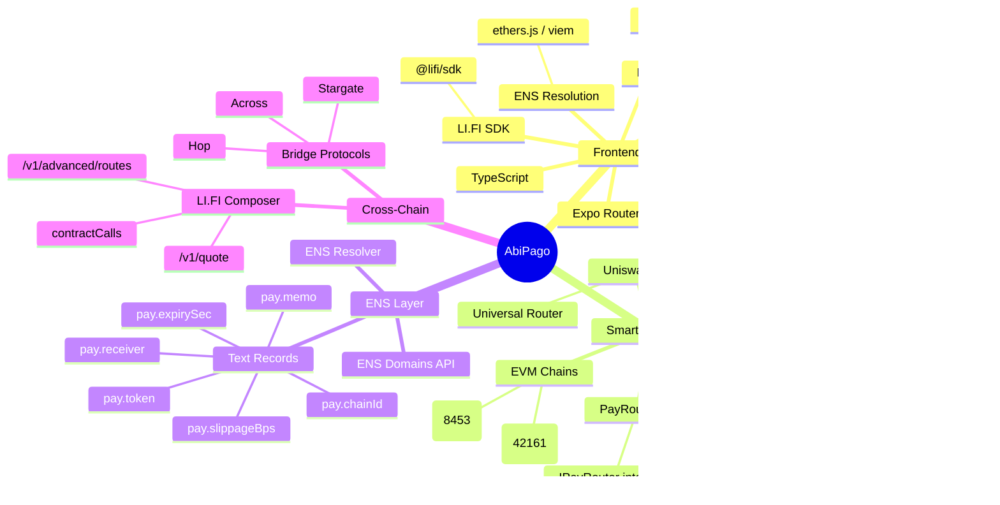

# AbiPago — Arquitectura del Sistema

> Documentación técnica con diagramas de arquitectura para entender cómo funcionan todos los componentes de AbiPago.

---

## 1. Vista General del Sistema

```mermaid
graph TB
    subgraph "📱 Mobile App (React Native / Expo)"
        HOME["🏠 Home Dashboard"]
        PAY["📷 Pay (QR / NFC)"]
        RECEIVE["💰 Merchant Invoice"]
        CONFIRM["✅ Confirm Payment"]
        PROGRESS["⏳ Routing Progress"]
        SUCCESS["🎉 Payment Success"]
    end

    subgraph "🌐 ENS (Ethereum Name Service)"
        ENS_NAME["cafeteria.eth"]
        ENS_RECORDS["Text Records\n• pay.receiver\n• pay.chainId\n• pay.token\n• pay.slippageBps\n• pay.memo"]
    end

    subgraph "🔗 LI.FI Composer"
        LIFI_API["LI.FI API\n/v1/quote\n/v1/advanced/routes"]
        LIFI_EXEC["Cross-chain\nSwap + Bridge"]
    end

    subgraph "⛓️ Destination Chain (e.g. Base)"
        PAYROUTER["📄 PayRouter Contract"]
        UNISWAP["🦄 Uniswap V4\n(Universal Router)"]
        MERCHANT_WALLET["💼 Merchant Wallet"]
    end

    subgraph "⛓️ Source Chain (e.g. Arbitrum)"
        PAYER_WALLET["👛 Payer Wallet"]
    end

    PAY -->|"1. Scan QR / Tap NFC"| ENS_NAME
    ENS_NAME -->|"2. Resolve"| ENS_RECORDS
    ENS_RECORDS -->|"3. Payment Profile"| CONFIRM
    CONFIRM -->|"4. Request route"| LIFI_API
    LIFI_API -->|"5. Best route"| CONFIRM
    CONFIRM -->|"6. User confirms"| PAYER_WALLET
    PAYER_WALLET -->|"7. Sign tx"| LIFI_EXEC
    LIFI_EXEC -->|"8. Bridge + Swap\n(cross-chain)"| PAYROUTER
    PAYROUTER -->|"9a. If swap needed"| UNISWAP
    UNISWAP -->|"9b. Swapped tokens"| PAYROUTER
    PAYROUTER -->|"10. Transfer final\ntokens + emit event"| MERCHANT_WALLET
    PAYROUTER -->|"11. PaymentExecuted\nevent"| SUCCESS
```

---

## 2. Flujo Completo de Pago (Secuencia)

```mermaid
sequenceDiagram
    actor Payer as 👤 Payer
    participant App as 📱 AbiPago App
    participant ENS as 🌐 ENS
    participant LIFI as 🔗 LI.FI API
    participant Wallet as 👛 WalletConnect
    participant SrcChain as ⛓️ Source Chain
    participant Bridge as 🌉 LI.FI Bridge
    participant DstChain as ⛓️ Dest Chain
    participant Router as 📄 PayRouter
    participant Uni as 🦄 Uniswap V4

    Note over Payer, App: 1️⃣ SCAN INVOICE
    Payer->>App: Scan QR code / Tap NFC tag
    App->>App: Parse URI: abipago://pay?ens=cafeteria.eth&amount=3.50&ref=coffee42

    Note over App, ENS: 2️⃣ RESOLVE ENS
    App->>ENS: resolve("cafeteria.eth")
    ENS-->>App: address: 0x84e5...3a19
    App->>ENS: getText("pay.receiver")
    ENS-->>App: 0x84e5...3a19
    App->>ENS: getText("pay.chainId")
    ENS-->>App: 8453 (Base)
    App->>ENS: getText("pay.token")
    ENS-->>App: 0x833589...2913 (USDC)
    App->>ENS: getText("pay.slippageBps")
    ENS-->>App: 50 (0.5%)

    Note over App, LIFI: 3️⃣ ROUTE CALCULATION
    App->>LIFI: POST /v1/advanced/routes
    Note right of App: fromChain: 42161 (Arbitrum)<br/>toChain: 8453 (Base)<br/>fromToken: ETH<br/>toToken: USDC<br/>fromAmount: 0.00125 ETH<br/>toAddress: PayRouter
    LIFI-->>App: Best route: Stargate bridge + Uniswap V4

    Note over App, Payer: 4️⃣ CONFIRM PAYMENT
    App->>Payer: Show: merchant, amount, route, fees
    Payer->>App: Tap "Confirm & Pay"

    Note over App, SrcChain: 5️⃣ EXECUTE TRANSACTION
    App->>Wallet: Request signature
    Wallet->>Payer: Approve tx
    Payer->>Wallet: ✅ Approve
    Wallet->>SrcChain: Submit tx (swap + bridge initiation)

    Note over SrcChain, DstChain: 6️⃣ CROSS-CHAIN BRIDGE
    SrcChain->>Bridge: Lock/burn tokens
    Bridge->>DstChain: Mint/release tokens
    Bridge->>Router: Call settle() with bridged tokens

    Note over Router, Uni: 7️⃣ SETTLEMENT
    alt tokenIn == tokenOut (USDC → USDC)
        Router->>DstChain: Direct transfer to merchant
    else tokenIn != tokenOut (WETH → USDC)
        Router->>Uni: V4_SWAP via Universal Router
        Uni-->>Router: USDC received
        Router->>DstChain: Transfer USDC to merchant
    end

    Note over Router, App: 8️⃣ CONFIRMATION
    Router->>Router: emit PaymentExecuted(ref, receiver, payer, ...)
    DstChain-->>App: Tx confirmed
    App->>Payer: 🎉 Payment Success!
```

---

## 3. Arquitectura del Smart Contract: PayRouter

---

## 4. Lógica Interna de `settle()` (Flowchart)

---

## 5. ENS como "Payment Profile" (Capa de Configuración)

```mermaid
graph LR
    subgraph "ENS Text Records de cafeteria.eth"
        R1["pay.receiver = 0x84e5...3a19"]
        R2["pay.chainId = 8453"]
        R3["pay.token = 0x8335...2913"]
        R4["pay.slippageBps = 50"]
        R5["pay.memo = Cafetería SCZ"]
        R6["pay.expirySec = 600"]
        R7["pay.router = 0xPayRouterAddr"]
    end

    APP["📱 AbiPago App"]
    APP -->|"ethers.getResolver(name)"| RESOLVER["ENS Resolver"]
    RESOLVER -->|"resolver.getText('pay.receiver')"| R1
    RESOLVER -->|"resolver.getText('pay.chainId')"| R2
    RESOLVER -->|"resolver.getText('pay.token')"| R3
    RESOLVER -->|"resolver.getText('pay.slippageBps')"| R4
    RESOLVER -->|"resolver.getText('pay.memo')"| R5
    RESOLVER -->|"resolver.getText('pay.expirySec')"| R6
    RESOLVER -->|"resolver.getText('pay.router')"| R7

    R1 --> PROFILE["PaymentProfile Object"]
    R2 --> PROFILE
    R3 --> PROFILE
    R4 --> PROFILE
    R5 --> PROFILE
    R6 --> PROFILE
    R7 --> PROFILE

    PROFILE --> LIFI["Build LI.FI route request"]
    PROFILE --> INVOICE["Build on-chain Invoice struct"]
```

---

## 6. Integración LI.FI Composer

```mermaid
sequenceDiagram
    participant App as 📱 App
    participant LIFI_API as 🔗 LI.FI API
    participant LIFI_Contract as 📄 LI.FI Contract
    participant PayRouter as 📄 PayRouter

    Note over App: User confirmed payment

    App->>LIFI_API: POST /v1/advanced/routes
    Note right of App: {<br/>"fromChainId": 42161,<br/>"toChainId": 8453,<br/>"fromTokenAddress": "0x0...ETH",<br/>"toTokenAddress": "0x833...USDC",<br/>"fromAmount": "1250000000000000",<br/>"fromAddress": "0xPayer",<br/>"toAddress": "PayRouter addr",<br/>"options": {<br/>  "slippage": 0.005,<br/>  "allowSwitchChain": true<br/>}<br/>}

    LIFI_API-->>App: Route with tx data

    App->>App: Build settle() calldata
    Note right of App: Encode:<br/>PayRouter.settle(<br/>  invoice,<br/>  tokenIn,<br/>  amountIn,<br/>  swapData<br/>)

    App->>LIFI_API: POST /v1/advanced/routes (with contractCall)
    Note right of App: Add "contractCalls" to route<br/>so LI.FI calls PayRouter.settle()<br/>after bridging

    LIFI_API-->>App: Final tx to sign

    App->>LIFI_Contract: Submit signed tx on source chain
    LIFI_Contract->>LIFI_Contract: Swap on source (if needed)
    LIFI_Contract->>PayRouter: Bridge + call settle()
    PayRouter->>PayRouter: Process payment
```

---

## 7. Flujo de Pantallas de la App

---

## 8. Stack Tecnológico

---

## 9. Modelo de Datos

